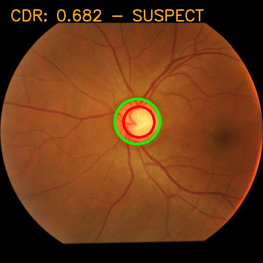
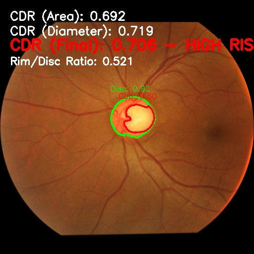

# Glaucoma Detection with YOLO and SAM
Automated glaucoma screening system that detects and segments the optic disc and cup from fundus images using **YOLO** object detection and **Segment Anything Model (SAM)** for precise segmentation.

---

## Features
- **YOLO Detection**: Fast and accurate detection of optic disc and cup regions  
- **SAM Segmentation**: Precise boundary segmentation for improved Cup-to-Disc Ratio (CDR) calculation  
- **Dual CDR Metrics**: Calculates CDR using both area-based and diameter-based methods  
- **Risk Assessment**: Automatic classification *(Normal / Suspect / High Risk)* based on CDR values  

---

## Getting Started

### 1. Clone the Repository
```bash
git clone https://github.com/MinooAhmadii/YOLO-SAM-MODEL.git
cd YOLO-SAM-MODEL
```

### 2. Download Required Models
Create the models directory and download both required models:
```bash
# Create models directory
mkdir -p src/models

# Download YOLO weights (place best.pt in src/models/)
# Download from GitHub Releases: https://github.com/MinooAhmadii/YOLO-SAM-MODEL/releases

# Download SAM checkpoint
wget https://dl.fbaipublicfiles.com/segment_anything/sam_vit_h_4b8939.pth -P src/models/
```

**Manual Download Links:**
- YOLO Model (best.pt): Download from Releases (~50MB)
- SAM Model (sam_vit_h_4b8939.pth): Download from Meta (~2.4GB)

Place both files in the `src/models/` directory.

### 3. Install Dependencies
This project uses `uv` for dependency management.
```bash
# Install uv if you haven't already
pip install uv

# Install project dependencies
uv pip install -e .

# Install SAM separately (from git repository)
pip install git+https://github.com/facebookresearch/segment-anything.git
```

---

## Usage

### Basic YOLO Detection
```bash
python yolo_detect_circles.py
```

### Enhanced SAM Segmentation
```bash
python yolo_sam_detect.py
```

---

## Results
<p align="center">
  
  
</p>

### Final Validation Metrics (YOLO Model)
**Overall**
- mAP50: 98.0%
- mAP50-95: 76.6%

**Optic Disc Detection**
- Precision: 99.9%
- Recall: 100%
- mAP50: 99.5%
- mAP50-95: 91.6%

**Optic Cup Detection**
- Precision: 96.1%
- Recall: 92.9%
- mAP50: 96.4%
- mAP50-95: 61.5%

---

## Training Details
- Training Set: 2,298 images
- Validation Set: 575 images

## Dataset
This model was trained on the [Glaucoma Dataset from Kaggle](https://www.kaggle.com/datasets/arnavjain1/glaucoma-datasets).

### Preprocessing Pipeline
1. Extracted optic disc and cup masks from the original dataset  
2. Applied image preprocessing to enhance mask quality  
3. Trained YOLO model on the preprocessed mask annotations  

---

## CDR Thresholds
- Normal: CDR < 0.5  
- Suspect: 0.5 ≤ CDR < 0.7  
- High Risk: CDR ≥ 0.7  

---

## Performance Metrics
- Detection Confidence: 0.25 threshold for optimal sensitivity  
- Segmentation: Multi-mask output with highest score selection  
- CDR Calculation: Average of area-based & diameter-based methods for robustness  

---

## Requirements
- Python 3.10+  
- PyTorch  
- Ultralytics YOLO  
- Segment Anything Model (SAM)  
- CUDA-capable GPU *(optional, for faster inference)*  
